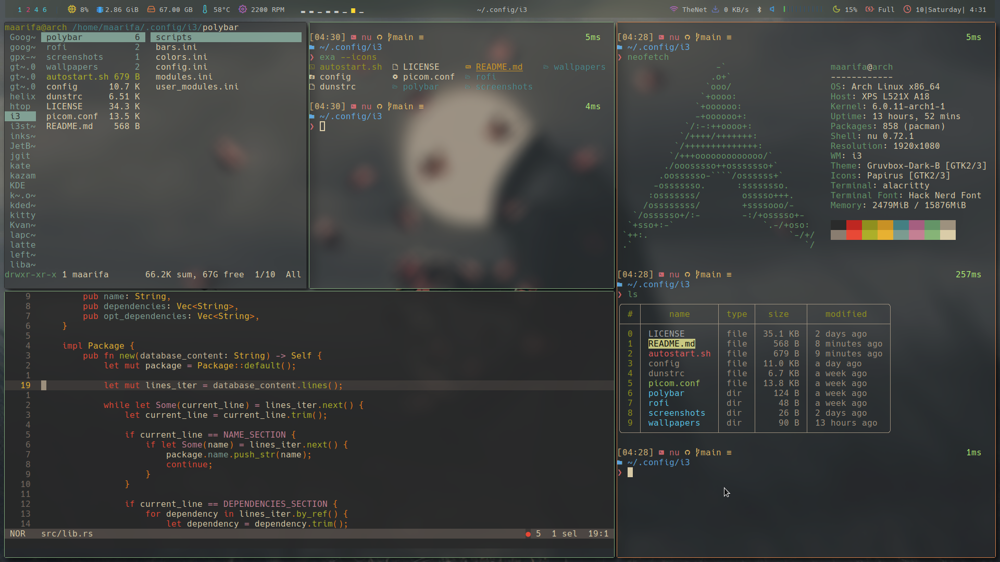

# my-i3-theme

All in one theme configuration files for the i3 window manager.



## prerequisites

- picom

- sxhkd

- polybar

- dunst

- rofi

- feh

- lxqt-policykit-agent

- alsamixer

- kazam

## installation

Clone the repo into your i3 config directory and reload i3

```shell
git clone https://github.com/MaarifaMaarifa/my-i3-theme ~/.config/i3
```

## credit

The polybar theme is a port, heavily influenced by the great theme forest over at [adi1090x / polybar-themes](https://github.com/adi1090x/polybar-themes)
